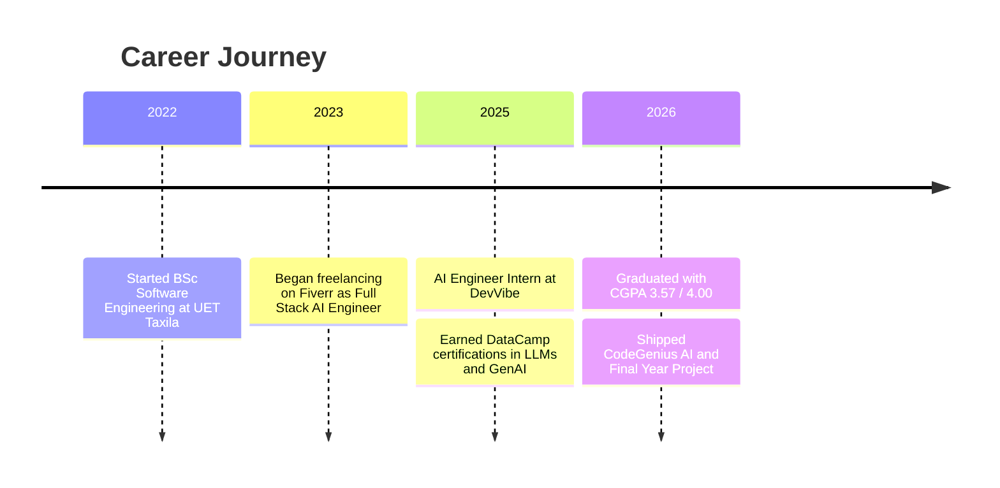

<!-- ============================================================
  HOW TO USE:
  1. Create a PUBLIC repo named exactly the same as your GitHub username
  2. Add this file as README.md
  3. Replace every YOUR_GITHUB_USERNAME with your real username
  4. Replace LinkedIn / Portfolio / repo links with your real ones
============================================================ -->

<!-- ===================== HEADER BANNER ===================== -->
<div align="center">


<a href="https://git.io/typing-svg">
  
</a>

<br/>


<br/>

<a href="mailto:hanzlazafar10@gmail.com"></a>
<a href="https://www.linkedin.com/in/YOUR_LINKEDIN"></a>
<a href="https://YOUR_PORTFOLIO_URL"></a>
<a href="https://wa.me/923323127063"></a>

</div>

<br/>

---

## 👨‍💻 About Me

<table>
<tr>
<td width="62%" valign="top">

```python
class HanzlaZafar:
    def __init__(self):
        self.role      = "AI Engineer | Software Engineer"
        self.location  = "Islamabad, Pakistan 🇵🇰"
        self.education = "BSc Software Engineering, UET Taxila (CGPA 3.57/4.00)"
        self.focus     = ["Generative AI", "Agentic AI", "LLMs", "RAG"]
        self.stack     = ["Python", "FastAPI", "LangChain", "AWS", "Docker"]
        self.status    = "Open to AI/ML Engineer opportunities 🚀"

    def mission(self):
        return "Build scalable AI products that solve real problems."
```

</td>
<td width="38%" valign="top">

- 🎓 Software Engineering graduate, **UET Taxila**
- 🤖 Building **RAG systems**, **multi-agent apps** & **LLM pipelines**
- ☁️ Deploying AI on **AWS (EC2, S3)** with **Docker** & **CI/CD**
- 💼 Freelance AI Engineer on **Fiverr** since 2023
- 🎯 Looking for **AI/ML Engineer** roles
- 📫 Reach me: **hanzlazafar10@gmail.com**

</td>
</tr>
</table>

---

## 🛠️ Tech Stack

<div align="center">

### 🧠 Languages


### 🤖 Machine Learning & Deep Learning


### ✨ Generative & Agentic AI


### ⚙️ Backend & Frontend


### ☁️ Cloud & DevOps


### 🗄️ Databases


### 🏗️ System Design
`Scalable Architecture` • `Microservices` • `Distributed Systems` • `API Design` • `Load Balancing` • `Caching`

</div>

---

## 🚀 Featured Projects

<table>
<tr>
<td width="50%" valign="top">

### 🎙️ Decoding Leadership
**LLM-Based Analysis of Political Speeches**
*Final Year Project • UET Taxila • Sep 2025 – Jun 2026*

End-to-end LLM pipeline covering audio transcription, sentiment analysis, topic modeling and promise-vs-achievement tracking, with a temporal comparison engine and an interactive analytics dashboard.


[🔗 View Repository](https://github.com/YOUR_GITHUB_USERNAME/REPO_NAME)

</td>
<td width="50%" valign="top">

### 🧬 CodeGenius AI
**Multi-Agent Software Engineering Assistant**
*Apr 2026*

Multi-agent system for code generation, debugging, explanation and SRS generation. Built with Groq LLaMA 3, LangChain and FastAPI; deployed on AWS EC2 via Docker and CI/CD with a React frontend.


[🔗 View Repository](https://github.com/YOUR_GITHUB_USERNAME/REPO_NAME)

</td>
</tr>
<tr>
<td width="50%" valign="top">

### 📚 MCP-Server Documentation Retrieval
*Dec 2025*

AI-powered documentation assistant that fetches and summarizes Python library docs (LangChain, LlamaIndex, OpenAI) and returns precise, source-cited answers.


[🔗 View Repository](https://github.com/YOUR_GITHUB_USERNAME/REPO_NAME)

</td>
<td width="50%" valign="top">

### 🤝 RAG Chatbots & Agentic Workflows
*Freelance & Internship work*

Document-driven chatbots and multi-step agentic applications using vector databases (FAISS, Pinecone), fine-tuned LLMs via Hugging Face, and production deployments on AWS.


</td>
</tr>
</table>

---

## 💼 Experience



| Role | Company | Period | Highlights |
|------|---------|--------|------------|
| 🤖 **AI Engineer Intern** | DevVibe, Multan | Jun 2025 – Aug 2025 | RAG apps, document chatbots, FAISS/Pinecone, AWS EC2/S3 + Docker, LLM fine-tuning, FastAPI pipelines |
| 💻 **Full Stack AI Engineer (Freelance)** | Fiverr | Jan 2023 – Present | Agentic AI apps, RAG systems, ML/DL model deployment, FastAPI & Flask APIs for global clients |

---

## 🎓 Education & Certifications

- 🏛️ **BSc. Software Engineering**, UET Taxila (Sep 2022 – Jun 2026), **CGPA 3.57 / 4.00**
- 📜 **Large Language Models (LLMs) Concepts**, DataCamp (Sep 2025)
- 📜 **Generative AI Concepts**, DataCamp (Oct 2025)

---

## 📊 GitHub Stats

<div align="center">


<br/>


<br/><br/>


</div>

---

## 🔭 What I'm Working On

- 🧠 Building more **multi-agent systems** with LangGraph
- 🔌 Exploring **Model Context Protocol (MCP)** servers and tool-using agents
- ☸️ Strengthening **Kubernetes** and **CI/CD** workflows for AI deployments
- 📖 Deepening knowledge of **LLM fine-tuning** and evaluation

---

## 🤝 Let's Collaborate

I'm open to **AI/ML Engineer** roles, freelance projects and open-source collaboration around **LLMs, RAG, and Agentic AI**.

<div align="center">

<a href="mailto:hanzlazafar10@gmail.com"></a>

<br/><br/>

> 💡 *"Build AI that is not just smart, but useful, scalable and production-ready."*

<br/>


</div>
